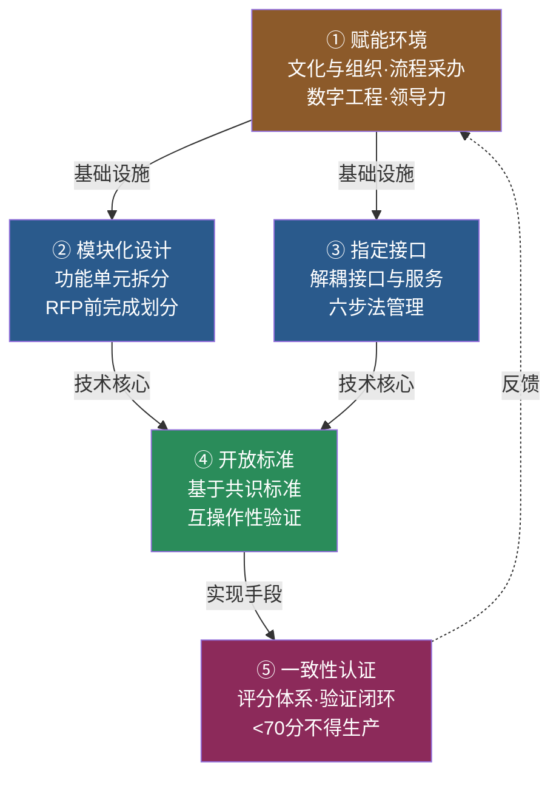
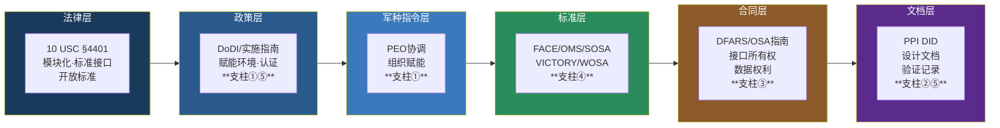

# MOSA五大支柱

## 来源

由 OUSD(R&E) 系统工程与架构（SE&A）部门于 2022年5月 建立，2025年2月 DoD MOSA实施指南正式确认。详见 [[国防部MOSA实施指南2025]]。

## 概述

五大支柱是 DoD 对「如何有效实施 MOSA」的结构化回答。它从 2013年OSA合同指南的「五原则」演化而来——核心变化是**从纯技术框架扩展为组织+技术+治理的综合体系**。详见 [[MOSA五原则到五支柱]]。

理解五大支柱的三条主线：

- **为什么要有五大支柱**：2013年五原则聚焦技术层面（模块化/接口/标准），但实施教训表明 MOSA 失败主因不在技术——在组织不会用、领导不承诺、采办流程不对齐。五大支柱通过新增「赋能环境」支柱和大幅扩展验证/治理维度来解决这个问题。

- **支柱之间不是孤立的**：支柱①（赋能环境）是基础设施，②（模块化设计）和③（指定接口）是技术核心，④（开放标准）是接口的实现手段，⑤（一致性认证）是验证闭环。缺失任一环节都会导致「检查清单式合规」而非实质性开放。

- **评估体系尚未完善**：五大支柱已有框架，但统一的强制性合规评分卡尚未形成——这是 GAO-25-106931 认为当前最大的系统性缺陷。详见 [[MOSA五支柱评估]]。

## 五大支柱详解

### ① 赋能环境（全新支柱）

「认识到 MOSA 失败主因不在技术，而在组织不会用。」

涵盖五个维度：

**文化与组织**
- 设定清晰 MOSA 目标，扩展能力与互操作性
- 组织结构与系统设计对齐（康威定律）
- 拥抱敏捷开发文化，基于持续反馈频繁小版本发布

**流程与采办**
- 改造需求、业务、管理、技术和采办实践，与 MOSA 原则对齐
- 更新合同、数据、许可、产权、计划等关键领域
- 部署 CI/CD 自动化

**数字工程整合**
- 采用数字工程实践，在模型中捕获 MOSA 要素
- 将模块化接口定义纳入 SysML/UAF 模型而非独立文档

**领导力** — GAO 审查发现：PEO 层级的正式跨项目 MOSA 协调是实施成功的关键区分因素。9个受审PEO中仅2个有此类流程。

### ② 模块化设计

「在发布 RFP 前明确模块化系统组件的所需功能。」

**核心收益**：快速升级/变更功能（对系统其他部分影响有限）、设计阶段隔离功能（简化开发/维护/变更）、模块独立于技术选型、故障隔离（单模块故障不拖垮全系统）。

**设计原则**：拆分为可扩展/可复用/自包含的功能单元；架构故障隔离；不可变且可丢弃（可在任意环境部署相同代码）。

**与2013年五原则的关系**：直接继承五原则中的「模块化设计」，但2025版强调**采办方在RFP发布前**就应完成模块化划分，而非依赖承包商事后设计。

**实例**：三军备忘录（2024）明确要求 WOSA 标准将武器系统拆分为可替换模块（制导/引信/战斗部/推进），每个模块有独立接口规范。

### ③ 指定接口

「解耦接口与服务实现，允许组件遵循独立的生命周期。」

**最佳实践六步法**：

1. **识别模块化接口**：充分分析，定义边界/特性，按关键程度排序
2. **制定接口管理计划（IMP）**：包含升级标准的流程/职责/程序
3. **指定接口所有权**：控制定义/开发/实施
4. **创建唯一标识符**：每个接口统一命名
5. **需求追溯**：从 MOSA/作战需求到接口规范的可追溯性
6. **接口文档化**：在接口需求规范（IRS）中维护详细记录

**与2013年五原则的关系**：合并了原则②（指定关键接口）和原则③（开放标准），因为实践中这两个维度高度耦合——指定接口的同时必须定义其标准化方式。

**关键挑战**（GAO 发现）：多数项目「指定了接口」但未区分**关键接口**与一般接口，导致资源分散、真正的竞争瓶颈未被打破。

### ④ 开放标准

「基于共识的标准标准化模块化系统接口。」

**优先级**：基于共识的国际标准 > 政府标准 > 行业标准 > 企业标准。三军备忘录（2019→2024）标准从4个扩展到6个：FACE、OMS、SOSA、VICTORY、AMS GRA、WOSA。另有 CMOSS、MORA、HOST、UCS、COARPS、SCARS 等 domain-specific 标准。

**核心实践**：最大可行程度下标准化接口；选择适配项目需求的适当标准；文档化并管理接口规范；保持接口开放，促进竞争。

**验证依据**：10 USC §4401 要求接口「符合广泛支持的、基于共识的标准」，或不满足时「按照 FY2021 NDAA §804 的要求交付机器可读格式的软件定义接口」。标准不是目标——**可验证的互操作性是目标**。

### ⑤ 一致性认证

「验证和确认 MOSA 实施，确保符合选定的开放接口标准。」

**成熟度评分**：2025年实施指南建立评分体系——满分100分，**得分低于70分的项目不得进入生产阶段**。这是五大支柱中最具「牙齿」的条款。

**认证活动**：指导自评的检查清单、明确的判定标准和验证方法、文档有效性验证、模块化需求验证、工具开发验证。

**现状**（GAO-25-106931）：20个受审项目中**无一进行正式 MOSA 成本效益分析**，因为 DoD 政策未强制要求。14条建议全部被国防部接受，包括：开发 MOSA 成本效益分析方法论（#1）、MTA 路径提供 MOSA 方向（#11）、及时发布全面指导（#12）。

**历史警示**：DoD IG 2000年审计发现（OSJTF成立6年后）与GAO 2025年发现惊人一致——「检查清单式合规」vs「实质性开放」的差距跨越25年仍然存在。一致性认证要打破的正是这个循环。

## 与实施全栈的对应

五大支柱贯穿 MOSA 的六层实施架构：

| 实施层 | 对应支柱 |
|---|---|
| 法律层（10 USC） | 支柱②③④ — 法律要求模块化设计/标准接口/开放标准 |
| 政策层（DoDI/实施指南） | 支柱①⑤ — 赋能环境+认证体系 |
| 军种指令层 | 支柱① — 组织赋能（PEO协调） |
| 标准层（FACE/OMS/SOSA等） | 支柱④ — 标准落地 |
| 合同层（DFARS/OSA指南） | 支柱③ — 接口所有权和数据权利 |
| 文档层（PPI DID） | 支柱②⑤ — 设计文档+验证记录 |

详见 [[MOSA实施栈]]。

## 相关内容

- [[MOSA五原则到五支柱]] — 12年演化脉络（五原则→五支柱）
- [[MOSA五支柱评估]] — OUSD评估框架详解
- [[MOSA与国防采办]] — MOSA核心概念
- [[国防部MOSA实施指南2025]] — 2025版实施指南
- [[GAO-MOSA专项审查报告全文]] — 20项目审查
- [[MOSA实施栈]] — 法律→合同六层架构
- [[开放系统架构合同指南V1.1]] — 五原则原始定义
- [[三军备忘录2019]] / [[三军备忘录2024]]
- [[项目管理与系统工程集成]] — 赋能环境支柱的组织维度
- [[MOSA五原则到五支柱]] — 五原则到五支柱的演变脉络
