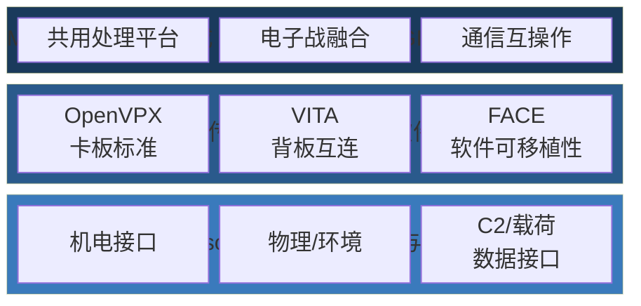
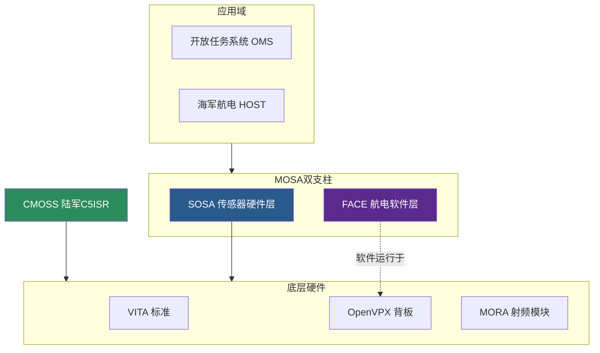

# 传感器开放系统架构（SOSA）

## 摘要

传感器开放系统架构（Sensor Open Systems Architecture, SOSA）是由The Open Group SOSA联盟开发的传感器领域开放系统架构标准，旨在为雷达、EO/IR、SIGINT、通信、电子战等传感器系统定义开放接口和模块化架构。SOSA是MOSA在传感器/C4ISR领域最成熟的标准之一，与FACE构成MOSA标准层的**双支柱**。2024年12月三军联合备忘录将SOSA列为6大已验证开放标准之一。



## 核心目标

> "Empower government and industry to collaboratively develop open standards and best practices to enable, enhance, and accelerate the deployment of affordable, capable, interoperable sensor systems."

## 架构层次

SOSA定义了三层标准化：

- **Sensor-to-Platform**：传感器与平台间标准化（电子机械、物理/环境、C2/载荷接口）
- **Intra-sensor**：传感器内部标准化（可互换硬件/软件组件，FACE™, OpenVPX, VITA）
- **Multi-INT**：多情报传感器集成（雷达+EO/IR+SIGINT共用处理平台）

## 核心特点

- **基于OpenVPX/VITA**：硬件卡板标准，确保物理层互换性
- **模块化传感器架构**：传感器功能拆分为独立可替换模块
- **跨军种适用**：The Open Group联盟驱动，覆盖陆海空天传感器
- **与FACE互补**：SOSA=传感器硬件/集成层，FACE=航电软件层
- **与CMOSS高度重叠**：共享底层标准（VITA, OpenVPX, MORA），CMOSS侧重陆军C5ISR

## 在GRA目标架构中的角色

Chris Garrett的AFMC演示（[[克里斯-加勒特演讲2024]]）显示，SOSA H/W是GRA目标架构中**几乎所有功能域的硬件基础**：

```
GRA目标架构 — SOSA作为通用硬件层

电子战    → SOSA H/W
传感/雷达 → SOSA H/W
通信      → SOSA H/W
自主      → SOSA H/W
PNT       → SOSA H/W
```

SOSA在GRA中的定位：
- **传感器GRA**：SOSA H/W作为传感器子系统硬件标准
- **与OMS配合**：SOSA定义硬件，OMS定义服务接口，两者分层协作
- **与HOST互补**：HOST是NAVAIR海军标准，SOSA是行业标准，三军互操作演示中联合使用

## SOSA与CMOSS的关系

- **CMOSS**侧重陆军C5ISR通用套件（Universal A-Kit + 卡板式硬件）
- **SOSA**侧重跨军种传感器标准化（The Open Group联盟驱动）
- 两者共享底层标准（VITA, OpenVPX, MORA）
- SOSA联盟中包含CMOSS团队成员

## 三军联合确认

2024年12月三军联合备忘录确认SOSA为6大已验证开放标准之一。TSOA-ID（三军互操作性演示）中：
- 使用**HOST/SOSA硬件** + **FACE软件**实现通信卡快速集成
- 陆军通信卡安装在各军种底盘上，跨演示场地通信
- **集成时间从数月/数年缩短到仅数周**

## 与DEWS MOSA RA的整合

SOSA联盟正在通过DEWS分委员会将SOSA与定向能武器MOSA参考架构（[[DEWS-MOSA参考架构]]）整合。整合形成三类模块：
- **DEWS-SOSA通用模块**（12个）
- **DEWS专用模块**（7个：DE源、波束传输、波束导向器等）
- **SOSA专用模块**（13个：发射器/收集器、信号检测器等）

## 与其他标准的关系

SOSA在MOSA标准生态中的定位——与CMOSS共享底层硬件标准，与FACE构成双支柱，以上承载OMS/HOST等上层标准：



- [[FACE技术标准]] — FACE定义航电软件层，SOSA定义传感器硬件层，两者互补构成MOSA双支柱
- [[开放任务系统]] — OMS定义任务系统服务接口，建立在SOSA硬件之上
- [[宿主硬件开放系统]] — HOST是NAVAIR海军标准，SOSA是行业标准，高度互补
- [[DEWS-MOSA参考架构]] — DEWS RA正在与SOSA整合
- [[CMOSS模块化标准概述]] — CMOSS与SOSA高度重叠，共享底层标准
- [[MOSA与国防采办]] — SOSA是MOSA在传感器领域的核心落地规范
- [[六项已验证的MOSA标准]] — 三军6大已验证标准之一

## 笔记

- SOSA在GRA目标架构中是真正的"底层硬件基座"——几乎所有功能域的硬件都基于SOSA H/W
- SOSA与FACE的关系经常被混淆：SOSA是硬件层（传感器模块化），FACE是软件层（航电可移植性）
- SOSA的The Open Group管理模式使其具有跨军种、跨供应商的中立性优势
- **TSOA-ID SDR快速开发案例**（2022）：Epiq Solutions + Sciens Innovations使用SOSA对齐组件在**两周内**创建完整SDR解决方案用于TSOA-ID演示，成本和进度减少**高达10倍**。验证了SOSA标准在快速原型和部署中的实际价值。来源：[[SOSA快速SDR开发案例2022]]
- **2026 MOSA Defense Summit**（第三届，2026.4.8-9）：PMA-209航电架构团队演示模块化航电机箱，采用**3U OpenVPX + VNX+混合背板**，为遗留系统提供灵活升级路径。Guertin评价MOSA"从爬到走到慢跑"。来源：[[NAVAIR第三届MOSA峰会2026]]

---

