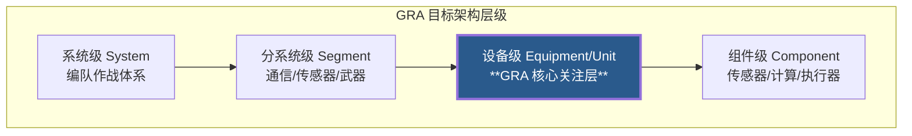
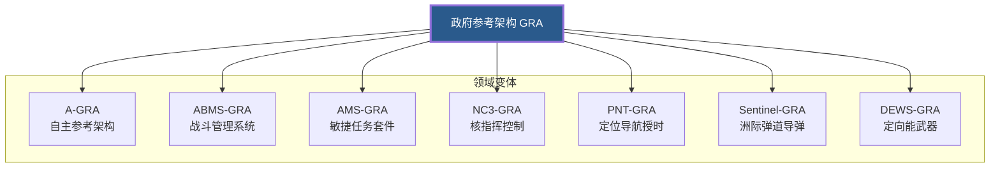

# 政府参考架构（GRA）模式

## 摘要

GRA（Government Reference Architecture）是美国政府拥有和维护的参考架构体系，覆盖从系统级到组件级的四层目标架构。本文概述 GRA 的定义、生态体系、标准集成及关键案例。

## 定义

**政府参考架构**（Government Reference Architecture, GRA）是由美国政府拥有和维护的参考架构，定义武器系统的**模块边界**和**标准化接口**，供承包商在竞标和开发中引用。GRA 是 MOSA 原则在架构层面的具体实施——**政府掌握架构定义权，通过标准化接口促进竞争和可移植性**。

核心公式：**GRA = 政府拥有 + 模块边界 + 开放接口 + 跨项目复用**。

### GRA 变体关系

GRA 各领域变体均遵循同一核心框架，面向不同作战域定制接口与模块划分：

## GRA 的「为什么」

传统模式下，主承包商在系统设计阶段定义架构和接口——这些成为承包商的**专有资产**，导致政府在上游被锁定。GRA 逆转了这一权力关系：

- 政府定义架构和接口 → 多家承包商在同一架构下竞争
- 接口开放、机器可读 → 承包商可替换而无需重新设计全系统
- 跨项目复用 → B-21 的航电架构可参考用于下一代战斗机

Chris Garrett（AFLCMC系统工程主管）的核心洞察：「GRA 是数字工程和 MOSA 的交汇点——模型承载架构，架构促进竞争。」

## GRA 生态系统：21种架构覆盖6+领域

GRA已从航空领域扩展到核力量、太空、PNT导航、自主系统等6+领域。

### 按四层架构层次分类

GRA 覆盖从平台级到组件级的完整层次体系（详见 [[开放架构层级]]）：

| 层 | 典型 GRA |
|---|---|
| **平台级** — 跨域顶层框架 | AV GRA（飞行器）、Sentinel GRA（ICBM） |
| **系统级** — 功能域架构 | ABMS GRA（战斗管理）、NC3 GRA（核指挥）、PNT GRA（导航）、SCARS GRA（训练模拟） |
| **子系统级** — 载荷/任务系统 | 武器 GRA（WOSA）、传感器 GRA（SOSA）、雷达 GRA（COARPS） |
| **组件级** — 设备/算法 | A-GRA（自主算法）、DEWS MOSA RA（定向能武器）、AMS GRA（敏捷任务套件） |

### 已确认的 GRA 清单

| GRA | 领域 | 成熟度 |
|---|---|---|
| **AV GRA** | 飞行器平台（79个MIL文档→36个系统模型） | 开发中（AFMC） |
| **Sentinel GRA** | 洲际弹道导弹 | 在 Sentinel 项目中应用 |
| **ABMS GRA** | 先进战斗管理系统 | DoD 级别 |
| **NC3 GRA** | 核指挥控制通信 | DoD 级别 |
| **AMS GRA** | 敏捷任务套件 | 2024年三军备忘录新增 |
| **A-GRA** | 自主系统（CCA 项目核心） | 2025年飞行验证通过 ✅ |
| **PNT GRA（R-EGI）** | 定位导航授时 | C-12J飞行测试验证 |
| **DEWS MOSA RA** | 定向能武器系统 | 已发布（MITRE文档） |
| **WOSA 武器 GRA** | 武器系统 | 2024年三军备忘录新增 |
| **传感器 GRA** | 传感器（基于 SOSA） | 已发布 |
| **COARPS** | 雷达系统 | RFI 阶段 |
| **SCARS GRA** | 训练模拟器 | 开发中 |
| **任务规划 GRA** | 任务规划系统 | 概念阶段 |

### GRA 的核心创新

**抽象模型分层**：GRA 采用三基线体系管理从抽象到具体的演进——
- 功能配置基线（Functional Configuration Baseline）：高层功能定义
- 分配配置基线（Allocation Configuration Baseline）：功能到模块的分配
- 生产配置基线（Production Configuration Baseline）：具体实现规范

**模型驱动**：AFMC 将 79 个 MIL 文档转换为 36 个系统模型，使用敏捷方法管理（Jira+Sprint）、VV&A 流程、JSON 格式。这是从文档驱动到模型驱动的典型实践。

**标准总线**：GRA 目标架构中，OMS/UCI 定位为「抽象服务总线（ASB）隔离器」——隔离 FACE/SOSA/UAI 等不同标准域，各域软件组件独立演进而不影响其他域。

## 标准集成

GRA 引用已验证的 MOSA 标准作为接口规范（详见 [[GRA生态演进]]）：

- **OMS/UCI** — 任务系统互操作性
- **FACE** — 航空电子设备可移植性
- **SOSA** — 传感器硬件标准化
- **WOSA** — 武器系统架构
- **UAI** — 通用武器接口
- **COARPS** — 雷达模块化
- **CMOSS** — C5ISR 标准套件

三军备忘录（2024）将标准从4个扩展到6个（新增 AMS GRA 和 WOSA），标志着 GRA 从概念框架进入强制实施阶段。

## 关键案例：CCA 与 A-GRA

A-GRA 是 GRA 模式最成功的验证案例。2025年 AFRL 成功验证了 A-GRA 在 CCA 项目中的应用——多家供应商的自主算法在同一架构下集成和飞行测试。

- **算法市场**：A-GRA 创建了设备级的自主算法通用标准，不同公司的 AI 算法在同一接口下竞争
- **供应商竞争实例**：Shield AI（Hivemind）和 Collins Aerospace 在同一 A-GRA 标准下竞争 CCA 自主算法
- **战略意义**：证明 GRA 可以实现「架构不变、算法迭代」——这正是 MOSA 的终极目标

详见 [[A-GRA自主参考架构]]、[[协同作战飞机]]。

## 与 MOSA 五支柱的关系

GRA 是五支柱在架构层的落地：

- **赋能环境**：政府拥有架构，定义竞争规则
- **模块化设计**：GRA 定义功能模块边界
- **指定接口**：GRA 标准化模块间接口
- **开放标准**：GRA 基于 MIL 标准和行业开放标准
- **一致性认证**：GRA 提供验证和确认框架（VV&A）

## 相关内容

- [[GRA生态演进]] — 从单一标准到四层体系
- [[开放架构层级]] — 开放架构四层体系
- [[A-GRA自主参考架构]] — 自主 GRA 详解
- [[克里斯-加勒特演讲2024]] — AFMC GRA 体系原始演示
- [[数字装备管理]] — DMM 与 GRA 的关系
- [[MOSA五支柱]] — GRA 对应的五大支柱
- [[三军备忘录2024]] — GRA 首次列为军种指令
- [[协同作战飞机]] — CCA 与 A-GRA
- [[空军预备役-A-GRA CCA验证2025]]
